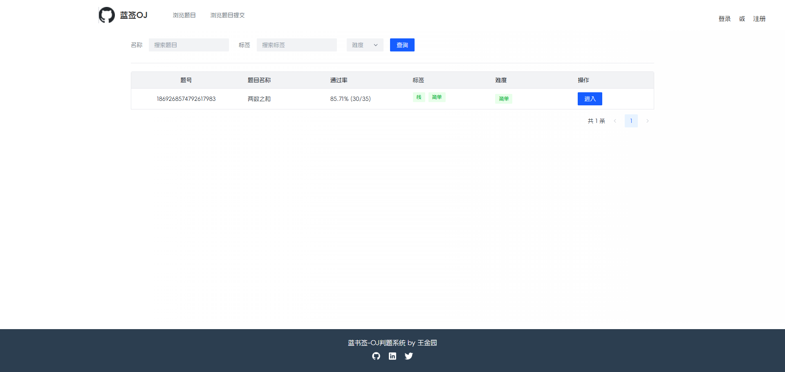
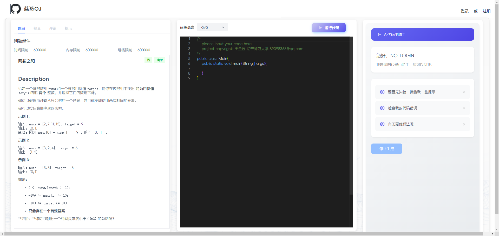
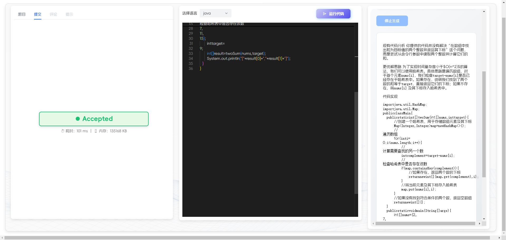
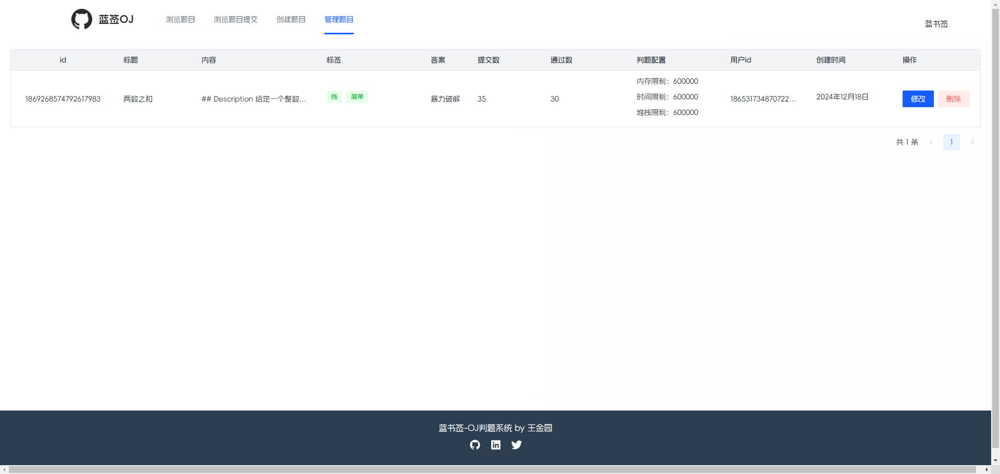

# 蓝签 OJ

## 项目介绍：
>项目介绍： 基于Spring Cloud微服务+RabbitMQ + Docker +DeepSeek+ Vue3 +Vuex + Arco Design  的编程题判题系统。系统能够根据管理员预设的题目用例对用户提交的代码进行执行和评测；其中系统中自主实现的代码沙箱可作为独立服务供其他开发者调用。

## 总体功能：
>
> 在系统前台，管理员可以创建、管理题目；用户可以自由搜索题目、阅读题目、编写并提交代码；
> 同时，项目接入deepseek用户可在线对代码进行AI问询。
> 在系统后端，能够根据管理员设定的题目测试，用例在自主实现的代码沙箱中对代码进行编译、运行、判
> 断输出是否正确。
>
> 
## 线上访问地址
> http://lanshuqian.top  
>
> 
## 项目亮点
>1.    后期选用Spring Cloud Alibaba重构了前期的单体项目。使用Redis分布式session存储登录态，并将整个项目按照职责模块划分。
>2.    使用 Java Runtime 对象的 exec 方法实现了对 Java 程序的编译和执行，并通过 Process 类 的输入流获取执行结果，实现了 Java 原生代码沙箱。
>3.    由于 Java 原生和 Docker 代码沙箱的实现流程完全一致（编译、执行、获取输出、清理），选用模板方法模式定义了一套标准的流程并允许子类自行扩展部分流程，提高代码一致性并大幅简化冗余代码。
>4.    安全方面：通过编写 Java 脚本自测代码沙箱，模拟了多种程序异常情况并针对性解决。如使用匿名守护线程 + Thread.sleep 等待机制实现了对进程的超时中断、使用 JVM -Xmx 参数限制用户程序占用的最大堆内存、使用 黑白名单 + 字典树 的方式实现了对敏感操作的限制
>5.    安全方面2：使用 Java 安全管理器和自定义的 Security Manager 对用户提交的代码进行权限控制，比如关闭写文件、执行文件权限，进一步提升了代码沙箱的安全性。
>6.    由于判题逻辑复杂、且不同题目的判题算法可能不同（如Java题目相对于C++要额外增加空间限制)，选用策略摸式代替if else独立封装了不同语言的判题算法，提高系统的可维护性。
>7.    为防止判题操作执行时间较长，系统选用异步的方式，在题目服务中将用户提交 id 发送给 RabbitMQ 消息队列，并通过 Direct 交换机转发给判题队列，由判题服务进行消费，异步更新提交状态。相比于同步，响应时长由530ms减少至 200ms左右。
>8.    前后端联调：使用openapi--typescript-codegen工具根据后端Swagger接口文档自动生成请求后端的代码，大幅提高开发效率。
>9.    接入DeepSeek大模型，实现了刷题网站的智能辅助功能，用户可以方便地进行题目练习、代码检查以及寻求解题思路等支持，提升了学习效率和用户体验。

## 项目界面展示

**登录、注册 界面:**

**项目主页:**

**刷题 + AI分析界面：**

**管理员题目管理：**

